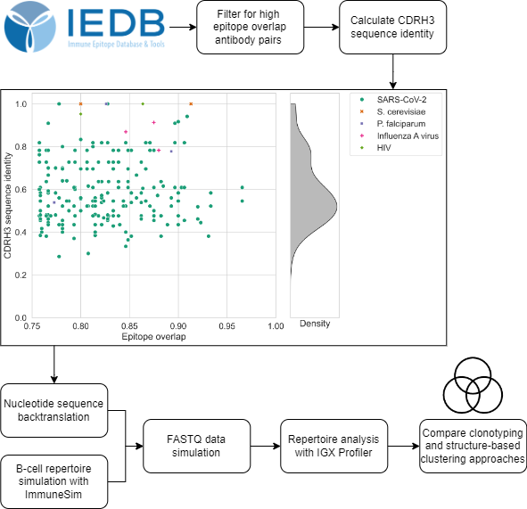

# Comparison of sequence- and structure-based antibody clustering approaches on simulated repertoire sequencing data

Repertoire sequencing allows us to investigate the antibody-mediated immune response. The clustering of sequences is a crucial step in the data analysis pipeline, aiding in the identification of functionally related antibodies. The conventional clustering approach of
clonotyping relies on sequence information, particularly CDRH3 sequence identity and V/J gene usage, to group sequences into clonotypes. It has been suggested that the limitations of sequence-based approaches to identify sequence-dissimilar but functionally converged antibodies can be overcome by using structure information to group antibodies. Recent advances have made structure-based methods feasible on a repertoire level. However, so far, their performance has only been evaluated on single-antigen sets of antibodies. A comprehensive comparison of the benefits and limitations of structure-based tools on realistic and diverse repertoire data is missing. Here, we aim to explore the promise of structure-based clustering algorithms to replace or augment the standard sequence-based approach, specifically by identifying low-sequence identity groups. Two methods, SAAB+ and SPACE2, are evaluated against clonotyping. We curated a dataset of well-annotated pairs of antibodies that show high overlap in epitope residues and thus bind the same region within their respective antigen. This set of antibodies was introduced into a simulated repertoire to compare the performance of clustering approaches on a diverse antibody set. Our analysis reveals that structure-based methods do produce more multiple-occupancy clusters compared to
clonotyping. However, it also highlights the limitations associated with the need for same-length CDR regions by SPACE2. This work thoroughly compares the utility of different clustering methods and provides insights into what further steps are required to effectively use antibody structural information to group immune repertoire data. 

## License
 
This work is dual-licensed under AGPL: GNU Affero General Public Licence version 3 (https://www.gnu.org/licenses/agpl-3.0.html), and a commercial licence agreement with ENPICOM B.V.
 
You can choose between either of these licences ('choice-of-licence') if you use this work.
 
For FOSS users, we recommend the AGPL licence. For users that cannot comply to AGPL or need a commercial licence, please contact ENPICOM B.V. for more details.

## Citation

TBD
